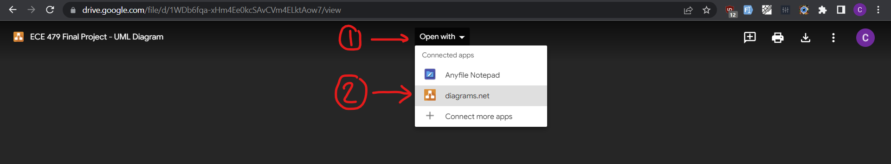

# Step 2: UML Diagram for System Architecture
Here is a link to a draw.io UML diagram: [UML Diagram](https://drive.google.com/file/d/1WDb6fqa-xHm4Ee0kcSAvCVm4ELktAow7/view?usp=sharing)

The file is stored in google drive, but it is editable using the draw.io
website. When you open the google drive link, there should be a way to open it
in draw.io or "diagrams.net" (you might have to add an extension or something
to google drive):

